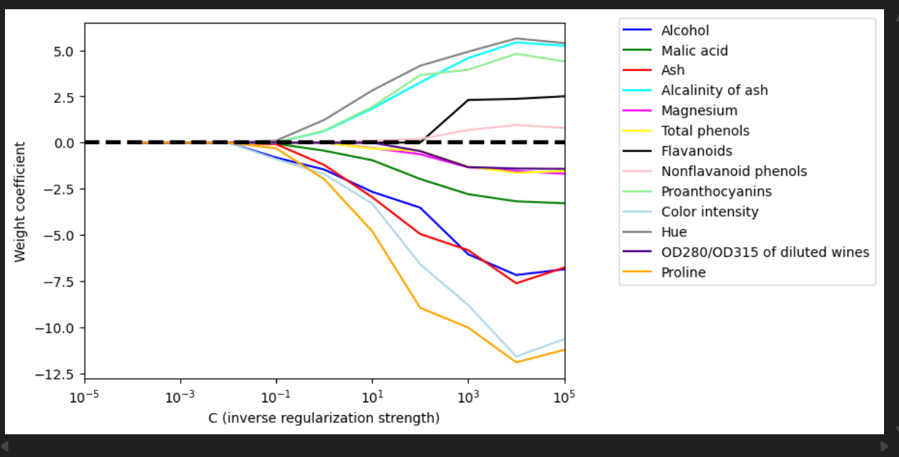

# Data_Preprocessing
Cleaning the data 

I also encoded using onehot encoder to  produces a binary feature per row,  find addtionaly info at  : https://contrib.scikit-learn.org/category_encoders/onehot.html

# effects of defferent c in L1(Lasso) with respect Logstic regression

